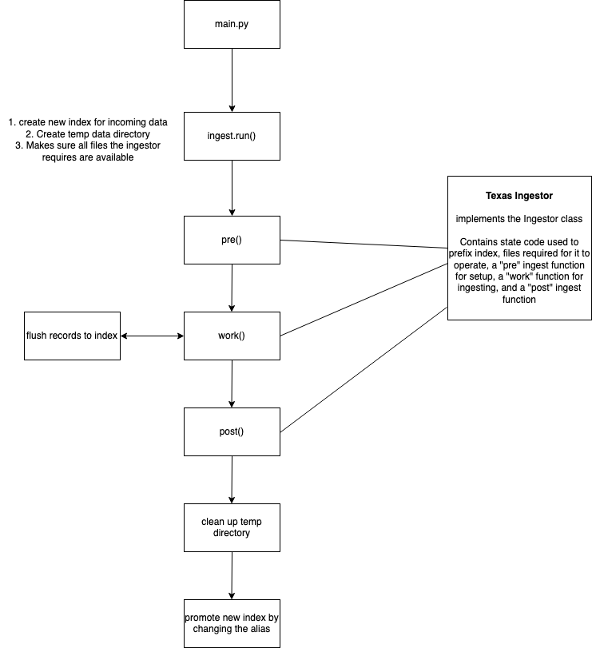

# state-fin-ingest
The goal of this package is to provide an easy way for researchers/analysts/data scientists to ingest contribution data from state legislature elections in a repeatable and scalable way.
Contributions are loaded via state-specific "ingestors" which standardize and clean-up the raw state-provided contribution data. The contributions are then flushed to an Elasticsearch cluster where further analysis can be performed (Note: in the future, data could potentially be flushed to alternate data sources).

At the moment, only a few state ingestors are available but the goal is to be able to load contribution data for all 50 state legislatures.

## Getting started
To get started, you need to have a .env file in the root directory with the `ES_HOST` variable that has the full path to the Elasticsearch cluster (including authentication).

You'll also need `poetry` installed on your local machine.

Running `poetry install` will install the dependencies.

Before being able to run the ingestors, you will likely have to download the contribution data for the states you are interested in. The directory for each state ingestor contains a README.md that describes the files required for that state's ingestion

To begin ingestion, run `poetry run python main.py`

## Gotchas / Known Issues
* We're only ingesting contributions that are linked to a candidate, candidate committee, or committee that's registered to support a candidate
* We're not ingesting data around expenditures or other campaign finance data, only contributions
* We're only ingesting data for state legislatures

## About the ingestion process
Before an ingestor's state specific ingestion work is performed, the main ingest process will create a temporary directory for the work. The ingest process will also create a new index in the Elasticsearch cluster where the name is prefixed by the state code specified by the ingestor and is suffixed by a datetime string. (TODO: we should also validate files required by the ingestor exist before beginning the ingest process)

Next, the ingestor's `pre()` function is called which performs any type of setup required to start. This could include building any necessary lookup dicitionaries, download more files, etc. 

After the `pre()` work is complete, the ingestor's `work()` generator is called which returns contribution records until no more records are left to consume. After a set number of records, the records will be flushed to the working Elasticsearch index created during setup.

After records have been consumed, the ingestor calls its `post()` function to do any spin down.

The ingest process will then cleanup the temporary directory that has been created and promotes the working index to be the main index for the state. This is achieved by removing the old index from the state index alias and adding the new index to the alias. This allows for a pretty seamless transition from the old data to the new data.

